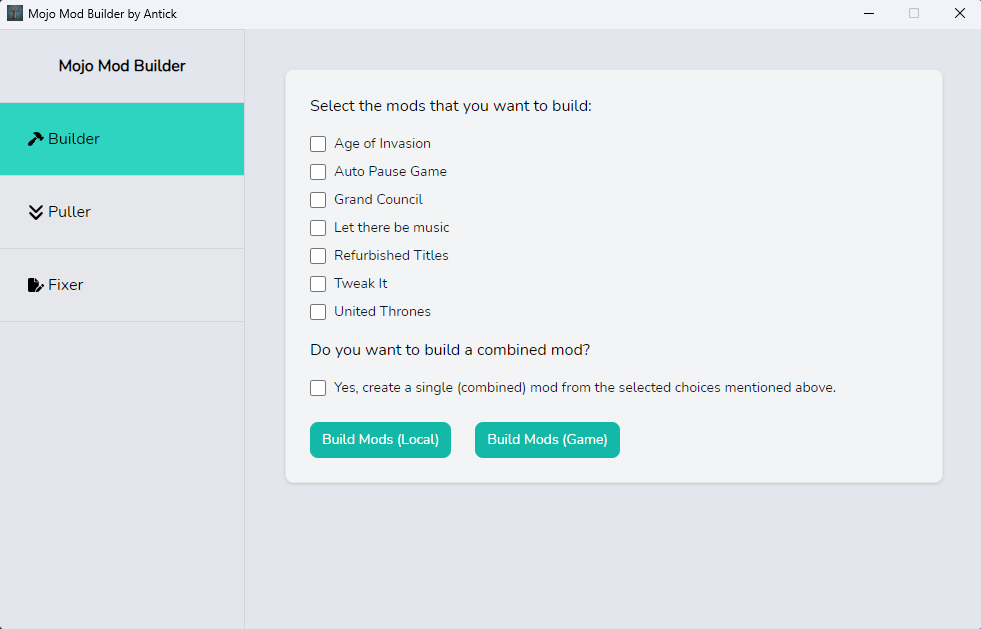

# Mojo

Mojo is a versatile tool designed for creating and managing mods for CK3 (Crusader Kings 3). Please note that this is
under heavy development so a lot of breaking updates would be coming until it reaches to version 1.0.



## What is Mojo?

Mojo lets you make mods in different parts, making it easy to manage and build. With this tool, not only can you pick
which parts to use for bigger and detailed mods, but you can also work on several small parts at the same time. This
lets you put together a big mod with all your ideas. Instead of having a lot of separate mods and worrying if they'll
work well together, you can group them using Mojo. Even if one part has problems, you can keep making the others in the
main mod space.

By splitting big mods into smaller parts, you can keep them working well, update them for new CK3 versions, and not
worry about the order they load. Check the guide (WIP) to learn how to write these smaller parts, build full mods, and
even put them on Steam the way you like.

This is a great tool for modders who manage a lot of mods and find it hard to keep track of them.

## Installation

Install Go 1.20 or higher:

https://go.dev/doc/install

Download and install Nodejs 21:

https://nodejs.org/en/download

Install Wails from their documentation:

https://wails.io/docs/gettingstarted/installation

## Usage

To run in live development mode, run `wails dev` in the project directory.

To build a redistributable executable, use `wails build` in the project directory.

## Development

### Frontend
```console
cd frontend
```

```console
npm install
```

#### Installing Components
To install components, use shadcn's CLI tool to install

More info here: https://ui.shadcn.com/docs/cli#add

Example:
```console
npx shadcn-ui@latest add [component]
```

#### Live Development

To run in live development mode, run `wails dev` in the project directory. In another terminal, go into the `frontend`
directory and run `npm run dev`. The frontend dev server will run on http://localhost:34115. Connect to this in your
browser and connect to your application.

## In-Built Mod

This tool also comes up with an in-built mod called Mojo that has a few features to help you get started.

### Load order in game

This should be the very last mod in your playlist.

```
...other mods
Mojo By Antick
```

### Compatibility

Compatibility with other mods may vary. A list of supported and unsupported mods will be updated as users provide
feedback through the mod's Steam page or GitHub issues.

Given the substantial changes in this mod, compatibility with existing saved games may be affected. Starting a new
game might be necessary for optimal functionality. The impact depends on the submods included, so please report any
encountered issues to help improve the mod.

#### Supported mods

Not tested with other mods yet.

#### Unsupported mods

Not tested with other mods yet. Please report any issues that you encounter.

### Required DLCs

Royal Court

Fate of Iberia

Tour and Tournaments

### Required Mods

None at the moment.

### Recommended Mods

CFP

EPE

### Supported CK3 Game Version

1.11.0.1

## Features

1. Convert paradox script files to JSON format.
2. Collection of pre-generated male and female DNA.
3. Collection of COA (Coat-of-Arms) templates.
4. In-built mods; Age of invasion, auto pause game, grand council, refurbished titles, united thrones, and more.

## Other wild ideas for the mod

1. New and intriguing events involving friends, family, enemies, vassals, courtiers, councilors, and your realm, enhancing gameplay diversity.
2. Family reunion and diverse religious events on cultural, religious, and regional occasions.
3. Expansion of traits and associated events.
4. Additional decisions to enrich gameplay options.
5. Events for skill advancement.
6. Rare and distinctive events offering opportunities to acquire resources like gold, prestige, piety, and renown.
7. Raiding events.
8. Trading events and decisions.
9. A captive system where you can ransom your enemies, use them for labor, or even use them as tribute or as payment. A new building type that after constructing in a barony allows you to access this system.

## Planned features in the app

1. Define a temporary path where CK3 game files can be pulled and compared with mod files, eliminating the need for manual comparison.
2. After pulling Ck3 game files, automatically detect any changes that may be required in the mod files you have.
3. Show logs in the app itself.
4. Rework on the paradox script file conversion.
5. A file viewer to check if the build was generated correctly in the Local build folder.
6. Show a loader when the app is doing something.
7. Handle incompatibilities in two submods effectively.
8. Find a way to distribute music mods. Since music mods cannot be uploaded to Github, we need to explore an alternative method for distribution. One option is to automate the process by uploading the music mod to a cloud storage service. Users can then use an application to easily download and place the files in the correct location with just a click of a button.
9. Allow user to configure the path in the app itself rather than hard coding those in the code.
10. Ability to use and merge existing mods from steam workshop with your mod on fly. Need to find a way to handle the incompatibility.
11. Create a simple app version for non-tech/non-dev users.

## FAQ

### Is it Ironman and Achievement compatible?

Yes.

## Pre-defined variables used in the mod text files

We have defined a few variables that can be used within the mod text file. These variables are helpful for compatibility detection and other important tasks while building mods.

Few examples:

```
# $canConflict=yes
# $modifiedGameFile=common\council_tasks\00_chancellor_tasks.txt
# $author=antick
# $relates_to=common\casus_belli_types\00_struggle_war.txt
```

These variables start with a `$` and are placed within the comment section of the mod text files. Currently, only the three variables mentioned above are supported.

The `$canConflict` variable can have a value of either `yes` or `no`. This indicates whether this file modifies a game file, and there may be a conflict if another mod writes to the same file and scope.

The `$modifiedGameFile` variable is the path of the game file that this mod text file modifies. This is used to detect conflicts with other mods.

The `$author` variable represents the name of the author of this mod text file. Currently, this variable does not have any significance and only for the informational purpose.

The `$relates_to` variable is used to specify the path of the mod text file that this mod text file relates to for the new updates. Every time there is an update in the specified file path, we will have to update the respective file where this variable is defined.

## Support

This free and open-source project is a labor of love created in my free time. I'll do my best to provide support whenever possible.
